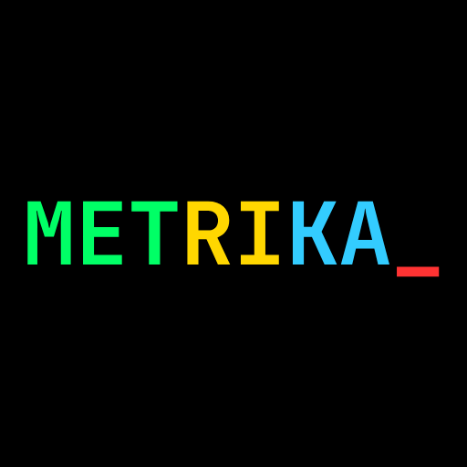

# ⏱️ Metrika - Performance Measurement Library for .NET

<p align="center">
  
</p>

<p align="center">
  <strong>Fluent, lightweight, and powerful performance measurement library for .NET applications</strong>
</p>

<p align="center">
  <a href="#features">Features</a> •
  <a href="#installation">Installation</a> •
  <a href="#why-metrika">Why Metrika?</a> •
  <a href="#quick-start">Quick Start</a> •
  <a href="#color-schemes">Color Schemes</a> •
  <a href="#documentation">Documentation</a> •
  <a href="#examples">Examples</a>
</p>

---

## ✨ Features

- ⚡ **Fluent API** - Intuitive extension methods for measuring async/sync operations
- 🎨 **Colorful Console Output** - Beautiful, color-coded console logging with 4 themes
- 🧠 **Memory Tracking** - Track memory allocation and GC collections
- ⏰ **Threshold Warnings** - Get alerted when operations exceed time limits
- 🌍 **Multi-Language** - Support for 10+ languages
- 🎯 **Custom Loggers** - Implement your own logging strategy
- 📊 **Zero Dependencies** - Core library has no external dependencies
- 🚀 **High Performance** - Minimal overhead on your application
- 🔌 **Easy Integration** - Works with ILogger, Serilog, NLog, etc.

---

## 🆚 Why Metrika?

### Comparison with Popular Alternatives

| Feature | Metrika | BenchmarkDotNet | MiniProfiler | App Metrics |
|---------|---------|-----------------|--------------|-------------|
| **Fluent API** | ✅ | ❌ | ⚠️ Partial | ❌ |
| **Colorful Console** | ✅ 4 themes | ❌ | ❌ | ❌ |
| **Memory Tracking** | ✅ Built-in | ✅ Advanced | ❌ | ✅ |
| **Easy Setup** | ✅ 2 lines | ❌ Complex | ⚠️ Moderate | ❌ Complex |
| **Real-time Monitoring** | ✅ | ❌ | ✅ | ✅ |
| **Zero Config** | ✅ | ❌ | ❌ | ❌ |
| **ILogger Integration** | ✅ | ❌ | ⚠️ Partial | ✅ |
| **Localization** | ✅ 10+ languages | ❌ | ❌ | ❌ |
| **Production Ready** | ✅ | ⚠️ Dev/Test only | ✅ | ✅ |
| **Learning Curve** | 🟢 Easy | 🔴 Steep | 🟡 Moderate | 🔴 Steep |
| **Package Size** | 🟢 ~50 KB | 🔴 ~2 MB | 🟡 ~500 KB | 🔴 ~5 MB |

### 🎯 Key Differentiators

#### **1. Fluent API Design**

```csharp
// ✅ Metrika - Clean and intuitive
var result = await GetUsersAsync().MetrikaAsync("Get Users");

// ❌ BenchmarkDotNet - Requires separate benchmark class
[Benchmark]
public async Task GetUsers() => await GetUsersAsync();

// ⚠️ MiniProfiler - Verbose
using (MiniProfiler.Current.Step("Get Users"))
{
    var result = await GetUsersAsync();
}

// ❌ App Metrics - Complex setup
var timer = _metrics.Measure.Timer.Time(new TimerOptions { Name = "Get Users" });
var result = await GetUsersAsync();
timer.Dispose();
```

#### **2. Zero Configuration**

```csharp
// ✅ Metrika - 2 lines to start
MetrikaCore.RegisterLogger(new ConsoleMetrikaLogger());
var result = myFunc.Metrika("Operation Name");

// ❌ BenchmarkDotNet - Complex configuration
var config = ManualConfig.Create(DefaultConfig.Instance)
    .AddExporter(HtmlExporter.Default)
    .AddDiagnoser(MemoryDiagnoser.Default);
BenchmarkRunner.Run<MyBenchmarks>(config);

// ❌ App Metrics - Complex setup
var metrics = new MetricsBuilder()
    .Configuration.Configure(options => { /* ... */ })
    .OutputMetrics.AsPrometheusPlainText()
    .Build();
```

#### **3. Beautiful Console Output**

- **Metrika**: Color-coded output with 4 customizable themes
- **BenchmarkDotNet**: Plain text tables (no colors)
- **MiniProfiler**: Web UI only (no console output)
- **App Metrics**: Plain text metrics (no colors)

#### **4. Production-Ready**

- **Metrika**: Designed for both development and production with minimal overhead
- **BenchmarkDotNet**: Primarily for benchmarking/testing, not recommended for production
- **MiniProfiler**: Production-ready but focused on web profiling
- **App Metrics**: Production-ready but requires complex infrastructure setup

#### **5. Lightweight**

- **Metrika.Core**: ~50 KB, zero dependencies
- **BenchmarkDotNet**: ~2 MB, multiple dependencies
- **MiniProfiler**: ~500 KB, requires database for storage
- **App Metrics**: ~5 MB, many dependencies for full functionality

---

## 📦 Installation

### NuGet Packages

```bash
# Core library (required)
dotnet add package Metrika.Core

# Console logger (optional)
dotnet add package Metrika.Console
```

### Manual Installation

```bash
git clone https://github.com/YOUR_USERNAME/Metrika.git
cd Metrika
dotnet build
```

---

## 🎨 Color Schemes

Metrika comes with 4 built-in color schemes to match your terminal preferences:

### 🌈 Default Theme (Recommended)

Perfect for light and dark terminals with full color support.

```
🟢 Fast Operations (<500ms)    - Green
🔵 Normal Operations (500-1s)  - Blue  
🟡 Slow Operations (>1s)       - Yellow
🔴 Threshold Exceeded          - Red
```

**Example:**

```csharp
MetrikaCore.RegisterLogger(new ConsoleMetrikaLogger(MetrikaColorScheme.Default));
```

**Output:**

```
[METRIKA] [14:30:45] [INFO] Fast Operation duration: 150 ms        🟢
[METRIKA] [14:30:46] [INFO] Normal Operation duration: 750 ms     🔵
[METRIKA] [14:30:47] [INFO] Slow Operation duration: 1500 ms      🟡
[METRIKA] [14:30:48] [WARN] Threshold Exceeded duration: 600 ms   🔴
```

---

### 🎀 Pastel Theme

Soft colors for extended viewing sessions.

```
🔷 Fast Operations    - Cyan
🟣 Normal Operations  - Magenta
🟤 Slow Operations    - Dark Yellow
🔺 Threshold Exceeded - Dark Red
```

**Example:**

```csharp
MetrikaCore.RegisterLogger(new ConsoleMetrikaLogger(MetrikaColorScheme.Pastel));
```

**Output:**

```
[METRIKA] [14:30:45] [INFO] API Call duration: 200 ms            🔷
[METRIKA] [14:30:46] [INFO] Database Query duration: 650 ms      🟣
[METRIKA] [14:30:47] [INFO] File Processing duration: 1200 ms    🟤
[METRIKA] [14:30:48] [WARN] Slow Query duration: 3000 ms         🔺
```

---

### ⚫ Monochrome Theme

For terminals without color support or minimalist preference.

```
⚪ Fast Operations    - Gray
⚪ Normal Operations  - White
⚫ Slow Operations    - Dark Gray
⚪ Threshold Exceeded - White
```

**Example:**

```csharp
MetrikaCore.RegisterLogger(new ConsoleMetrikaLogger(MetrikaColorScheme.Monochrome));
```

**Output:**

```
[METRIKA] [14:30:45] [INFO] Operation 1 duration: 100 ms
[METRIKA] [14:30:46] [INFO] Operation 2 duration: 600 ms
[METRIKA] [14:30:47] [INFO] Operation 3 duration: 1100 ms
[METRIKA] [14:30:48] [WARN] Operation 4 duration: 2000 ms
```

---

### 🌑 Dark Theme

Optimized for dark terminal backgrounds.

```
🟢 Fast Operations    - Dark Green
🔷 Normal Operations  - Dark Cyan
🟡 Slow Operations    - Dark Yellow
🔴 Threshold Exceeded - Dark Red
```

**Example:**

```csharp
MetrikaCore.RegisterLogger(new ConsoleMetrikaLogger(MetrikaColorScheme.Dark));
```

**Output:**

```
[METRIKA] [14:30:45] [INFO] Load Data duration: 180 ms           🟢
[METRIKA] [14:30:46] [INFO] Transform duration: 720 ms           🔷
[METRIKA] [14:30:47] [INFO] Save Results duration: 1300 ms       🟡
[METRIKA] [14:30:48] [WARN] Bulk Insert duration: 5000 ms        🔴
```

---

### 🎨 Custom Color Scheme

Create your own color scheme:

```csharp
var customScheme = new MetrikaColorScheme
{
    FastColor = ConsoleColor.Green,
    NormalColor = ConsoleColor.Cyan,
    SlowColor = ConsoleColor.Magenta,
    ThresholdExceededColor = ConsoleColor.Red
};

MetrikaCore.RegisterLogger(new ConsoleMetrikaLogger(customScheme));
```

---

### 📊 Color Scheme Comparison

| Theme | Fast | Normal | Slow | Threshold | Best For |
|-------|------|--------|------|-----------|----------|
| **Default** | 🟢 Green | 🔵 Blue | 🟡 Yellow | 🔴 Red | Most terminals |
| **Pastel** | 🔷 Cyan | 🟣 Magenta | 🟤 Dark Yellow | 🔺 Dark Red | Long sessions |
| **Monochrome** | ⚪ Gray | ⚪ White | ⚫ Dark Gray | ⚪ White | No color support |
| **Dark** | 🟢 Dark Green | 🔷 Dark Cyan | 🟡 Dark Yellow | 🔴 Dark Red | Dark terminals |

---

### 💡 Choosing a Color Scheme

```csharp
// For Windows Terminal, PowerShell, macOS Terminal
MetrikaCore.RegisterLogger(new ConsoleMetrikaLogger(MetrikaColorScheme.Default));

// For VS Code integrated terminal
MetrikaCore.RegisterLogger(new ConsoleMetrikaLogger(MetrikaColorScheme.Dark));

// For CI/CD pipelines (Jenkins, GitHub Actions)
MetrikaCore.RegisterLogger(new ConsoleMetrikaLogger(MetrikaColorScheme.Monochrome));

// For extended coding sessions
MetrikaCore.RegisterLogger(new ConsoleMetrikaLogger(MetrikaColorScheme.Pastel));

// Disable colors
MetrikaCore.RegisterLogger(new ConsoleMetrikaLogger(useColors: false));
```

---

## 🚀 Quick Start

### 1. Basic Setup

```csharp
using Metrika.Core;
using Metrika.Core.Models;
using Metrika.Console;

// Register console logger with your preferred theme
MetrikaCore.RegisterLogger(new ConsoleMetrikaLogger(MetrikaColorScheme.Default));

// Configure global settings
MetrikaCore.ConfigureTimestampFormat(MetrikaTimestampFormat.Short);
MetrikaCore.ConfigureLocalization(MetrikaLocalization.English);
```

### 2. Measure Sync Operations

```csharp
// Measure a function
var result = new Func<int>(() =>
{
    // Your code here
    return 42;
}).Metrika("Calculate Answer");

// Measure an action
new Action(() =>
{
    // Your code here
}).Metrika("Process Data");
```

### 3. Measure Async Operations

```csharp
// Measure async Task<T>
var users = await _dbContext.Users
    .ToListAsync()
    .MetrikaAsync("Get Users", thresholdMs: 500);

// Measure async Task
await SendEmailAsync(email)
    .MetrikaAsync("Send Email", thresholdMs: 2000);
```

---

## 📚 Documentation

### Basic Usage

#### Measuring Functions

```csharp
var result = new Func<List<User>>(() =>
{
    return database.GetUsers();
}).Metrika("Fetch Users");
```

#### Measuring with Threshold

```csharp
var result = new Func<string>(() =>
{
    return HeavyCalculation();
}).Metrika("Heavy Calculation", thresholdMs: 100);

// Output if exceeded:
// [METRIKA] [14:30:45] [WARN] Heavy Calculation duration high: 150 ms (threshold: 100 ms)
```

#### Measuring with Memory Tracking

```csharp
var data = new Func<byte[]>(() =>
{
    return new byte[5_000_000]; // 5 MB
}).Metrika("Allocate Memory", trackMemory: true);

// Output:
// [METRIKA] [14:30:45] [INFO] Allocate Memory duration: 10 ms | Memory: +5.00 MB | GC: Gen0: 1, Gen1: 0, Gen2: 0
```

#### Async Operations

```csharp
// Database query
var users = await _dbContext.Users
    .Where(u => u.IsActive)
    .ToListAsync()
    .MetrikaAsync("Get Active Users", thresholdMs: 500);

// API call
var response = await _httpClient
    .GetAsync("https://api.example.com/data")
    .MetrikaAsync("External API Call", thresholdMs: 2000);
```

---

### Advanced Configuration

#### Timestamp Formats

```csharp
// Short format: HH:mm:ss
MetrikaCore.ConfigureTimestampFormat(MetrikaTimestampFormat.Short);

// ISO 8601: 2025-10-19T14:30:45.123Z
MetrikaCore.ConfigureTimestampFormat(MetrikaTimestampFormat.ISO8601);

// Unix timestamp
MetrikaCore.ConfigureTimestampFormat(MetrikaTimestampFormat.UnixTimestamp);

// Custom format
MetrikaCore.ConfigureTimestampFormat(
    MetrikaTimestampFormat.Custom("dd/MM/yyyy HH:mm:ss")
);

// Disable timestamp
MetrikaCore.ConfigureTimestampFormat(MetrikaTimestampFormat.Disabled);
```

#### Localization

```csharp
// English (default)
MetrikaCore.ConfigureLocalization(MetrikaLocalization.English);

// Turkish
MetrikaCore.ConfigureLocalization(MetrikaLocalization.Turkish);

// Other supported languages
MetrikaCore.ConfigureLocalization(MetrikaLocalization.French);
MetrikaCore.ConfigureLocalization(MetrikaLocalization.German);
MetrikaCore.ConfigureLocalization(MetrikaLocalization.Spanish);
MetrikaCore.ConfigureLocalization(MetrikaLocalization.Japanese);
MetrikaCore.ConfigureLocalization(MetrikaLocalization.ChineseSimplified);
MetrikaCore.ConfigureLocalization(MetrikaLocalization.Russian);
MetrikaCore.ConfigureLocalization(MetrikaLocalization.Portuguese);
MetrikaCore.ConfigureLocalization(MetrikaLocalization.Italian);

// Custom localization
MetrikaCore.ConfigureLocalization(new MetrikaLocalization
{
    Duration = "tempo",
    DurationHigh = "tempo alto",
    Prefix = "MEDIDA",
    Memory = "Memória",
    Milliseconds = "ms",
    Threshold = "limite"
});
```

#### Memory Tracking

```csharp
// Enable globally for all measurements
MetrikaCore.ConfigureMemoryTracking(true);

// Or enable per-measurement
var result = new Func<byte[]>(() => new byte[1_000_000])
    .Metrika("Allocate", trackMemory: true);

// Disable globally
MetrikaCore.ConfigureMemoryTracking(false);

// Override global setting per-measurement
var result = new Func<byte[]>(() => new byte[1_000_000])
    .Metrika("Allocate", trackMemory: false);
```

#### Using ILogger (ASP.NET Core)

```csharp
// In your controller or service
public class UserService
{
    private readonly ILogger<UserService> _logger;
    private readonly AppDbContext _dbContext;

    public UserService(ILogger<UserService> logger, AppDbContext dbContext)
    {
        _logger = logger;
        _dbContext = dbContext;
    }

    public async Task<List<User>> GetUsersAsync()
    {
        return await _dbContext.Users
            .ToListAsync()
            .MetrikaAsync("Get Users", thresholdMs: 500, logger: _logger);
    }
}
```

**ILogger Output:**

```
info: MyApp.Services.UserService[0]
      Get Users duration: 245 ms
```

---

### Custom Loggers

Implement your own logger by implementing `IMetrikaLogger`:

```csharp
using Metrika.Core.Abstractions;
using Metrika.Core.Models;

public class FileMetrikaLogger : IMetrikaLogger
{
    private readonly string _filePath;

    public FileMetrikaLogger(string filePath)
    {
        _filePath = filePath;
    }

    public void LogMeasurement(
        MetrikaMeasurementResult result,
        MetrikaLocalization localization,
        MetrikaTimestampFormat timestampFormat)
    {
        var message = $"{result.Timestamp:yyyy-MM-dd HH:mm:ss} | " +
                      $"{result.Name} | " +
                      $"{result.ElapsedMilliseconds} ms";
        
        if (result.MemoryInfo != null)
        {
            message += $" | Memory: {result.MemoryInfo.MemoryDeltaMB:+0.00;-0.00} MB";
        }
        
        File.AppendAllText(_filePath, message + Environment.NewLine);
    }
}

// Register custom logger
MetrikaCore.RegisterLogger(new FileMetrikaLogger("performance.log"));

// You can register multiple loggers
MetrikaCore.RegisterLogger(new ConsoleMetrikaLogger());
MetrikaCore.RegisterLogger(new FileMetrikaLogger("performance.log"));
```

---

## 💡 Examples

### Example 1: Web API Performance Monitoring

```csharp
[ApiController]
[Route("api/[controller]")]
public class UsersController : ControllerBase
{
    private readonly ILogger<UsersController> _logger;
    private readonly AppDbContext _dbContext;

    [HttpGet]
    public async Task<IActionResult> GetUsers()
    {
        var users = await _dbContext.Users
            .ToListAsync()
            .MetrikaAsync("Get All Users", thresholdMs: 500, logger: _logger);

        return Ok(users);
    }

    [HttpPost]
    public async Task<IActionResult> CreateUser([FromBody] User user)
    {
        await _dbContext.Users.AddAsync(user);
        
        await _dbContext
            .SaveChangesAsync()
            .MetrikaAsync("Save User to DB", thresholdMs: 200, logger: _logger);

        return CreatedAtAction(nameof(GetUsers), new { id = user.Id }, user);
    }
}
```

---

### Example 2: Multi-Step Process

```csharp
public async Task<ProcessResult> ProcessOrderAsync(int orderId)
{
    // Step 1: Fetch order
    var order = await _dbContext.Orders
        .Include(o => o.Items)
        .FirstOrDefaultAsync(o => o.Id == orderId)
        .MetrikaAsync("Fetch Order", thresholdMs: 300, logger: _logger);

    // Step 2: Validate order
    var isValid = new Func<bool>(() => ValidateOrder(order))
        .Metrika("Validate Order", logger: _logger);

    // Step 3: Calculate total
    var total = new Func<decimal>(() => CalculateTotal(order))
        .Metrika("Calculate Total", trackMemory: true, logger: _logger);

    // Step 4: Send notification
    await SendNotificationAsync(order)
        .MetrikaAsync("Send Notification", thresholdMs: 2000, logger: _logger);

    return new ProcessResult { Total = total, IsValid = isValid };
}
```

**Console Output:**

```
[METRIKA] [14:30:45] [INFO] Fetch Order duration: 245 ms
[METRIKA] [14:30:45] [INFO] Validate Order duration: 5 ms
[METRIKA] [14:30:45] [INFO] Calculate Total duration: 2 ms | Memory: +0.05 MB | GC: Gen0: 0, Gen1: 0, Gen2: 0
[METRIKA] [14:30:46] [INFO] Update Inventory duration: 320 ms
[METRIKA] [14:30:48] [INFO] Send Notification duration: 1850 ms
```

---

### Example 3: Background Job with Memory Tracking

```csharp
public class DataSyncJob
{
    public async Task ExecuteAsync()
    {
        // Fetch from external API
        var externalData = await _httpClient
            .GetFromJsonAsync<List<Item>>("https://api.example.com/items")
            .MetrikaAsync("Fetch External Data", thresholdMs: 5000, trackMemory: true);

        // Transform data
        var transformed = new Func<List<Item>>(() => TransformData(externalData))
            .Metrika("Transform Data", trackMemory: true);

        // Bulk insert
        await _dbContext.Items
            .AddRangeAsync(transformed)
            .MetrikaAsync("Bulk Insert", thresholdMs: 3000);

        await _dbContext
            .SaveChangesAsync()
            .MetrikaAsync("Save Changes", thresholdMs: 5000, trackMemory: true);
    }
}
```

---

### Example 4: LINQ Query Optimization

```csharp
// Compare different query approaches
var approach1 = await _dbContext.Users
    .ToListAsync()
    .MetrikaAsync("Approach 1: Load All", trackMemory: true);

var approach2 = await _dbContext.Users
    .Where(u => u.IsActive)
    .ToListAsync()
    .MetrikaAsync("Approach 2: Filter in DB", trackMemory: true);

var approach3 = await _dbContext.Users
    .Where(u => u.IsActive)
    .Select(u => new { u.Id, u.Name })
    .ToListAsync()
    .MetrikaAsync("Approach 3: Filter and Project", trackMemory: true);
```

**Console Output:**

```
[METRIKA] [14:30:45] [INFO] Approach 1: Load All duration: 850 ms | Memory: +45.00 MB | GC: Gen0: 5, Gen1: 2, Gen2: 1
[METRIKA] [14:30:46] [INFO] Approach 2: Filter in DB duration: 320 ms | Memory: +12.50 MB | GC: Gen0: 2, Gen1: 0, Gen2: 0
[METRIKA] [14:30:46] [INFO] Approach 3: Filter and Project duration: 280 ms | Memory: +8.25 MB | GC: Gen0: 1, Gen1: 0, Gen2: 0
```

---

### Example 5: Localization

```csharp
// English
MetrikaCore.ConfigureLocalization(MetrikaLocalization.English);
new Func<int>(() => Calculate()).Metrika("Calculate", thresholdMs: 50);
// Output: [METRIKA] [14:30:45] [WARN] Calculate duration high: 100 ms (threshold: 50 ms)

// Turkish
MetrikaCore.ConfigureLocalization(MetrikaLocalization.Turkish);
new Func<int>(() => Calculate()).Metrika("Hesapla", thresholdMs: 50);
// Output: [METRİKA] [14:30:45] [WARN] Hesapla süresi yüksek: 100 ms (eşik: 50 ms)

// Japanese
MetrikaCore.ConfigureLocalization(MetrikaLocalization.Japanese);
new Func<int>(() => Calculate()).Metrika("計算", thresholdMs: 50);
// Output: [メトリカ] [14:30:45] [WARN] 計算 処理時間が長い: 100 ミリ秒 (閾値: 50 ミリ秒)
```

---

## 🏗️ Project Structure

```
Metrika/
├── Metrika.Core/                    # Core library (50 KB)
│   ├── MetrikaCore.cs              # Main fluent API
│   ├── Abstractions/
│   │   └── IMetrikaLogger.cs       # Logger interface
│   └── Models/
│       ├── MetrikaMeasurementResult.cs
│       ├── MetrikaMemoryInfo.cs
│       ├── MetrikaLocalization.cs
│       └── MetrikaTimestampFormat.cs
├── Metrika.Core.Tests/             # Core tests (54 tests)
├── Metrika.Console/                # Console logger
│   ├── ConsoleMetrikaLogger.cs
│   └── MetrikaColorScheme.cs
├── Metrika.Console.Tests/          # Console tests (15 tests)
├── Metrika.Examples.ConsoleApp/    # Example application
└── assets/
    ├── metrika-icon.png            # Project icon
    └── screenshots/                # Screenshots
```

---

## 🧪 Testing

```bash
# Run all tests
dotnet test

# Run with coverage
dotnet test --collect:"XPlat Code Coverage"

# Run specific test project
dotnet test Metrika.Core.Tests
dotnet test Metrika.Console.Tests
```

**Test Coverage:**

- Metrika.Core: 54 tests ✅
- Metrika.Console: 15 tests ✅
- Total: 69 tests ✅

---

## 🤝 Contributing

Contributions are welcome! Please feel free to submit a Pull Request.

1. Fork the repository
2. Create your feature branch (`git checkout -b feature/AmazingFeature`)
3. Commit your changes (`git commit -m 'feat: Add some AmazingFeature'`)
4. Push to the branch (`git push origin feature/AmazingFeature`)
5. Open a Pull Request

---

## 📄 License

This project is licensed under the MIT License - see the [LICENSE](LICENSE) file for details.

---

## 🌟 Show Your Support

If you find this project helpful, please give it a ⭐️ on GitHub!

---

## 📞 Contact

- GitHub: [@alierguc1](https://github.com/alierguc1)
- Email: your.email@example.com

---

## 🎯 Roadmap

### Version 1.1 (Q1 2025)

- [ ] ASP.NET Core middleware integration
- [ ] SignalR logger for real-time monitoring
- [ ] Performance dashboard UI

### Version 1.2 (Q2 2025)

- [ ] Database logger (SQL Server, PostgreSQL)
- [ ] Elasticsearch integration
- [ ] Prometheus metrics exporter

### Version 2.0 (Q3 2025)

- [ ] Blazor component for visualization
- [ ] Advanced analytics and reporting
- [ ] Performance anomaly detection

---

<p align="center">
  <strong>Made with ❤️ by <a href="https://github.com/alierguc1">M. Ali Ergüç</a></strong>
</p>
